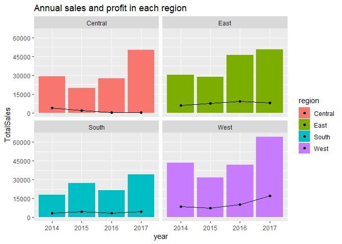
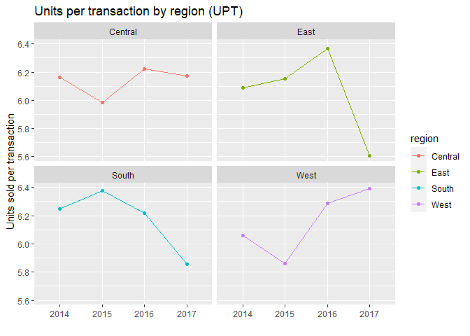
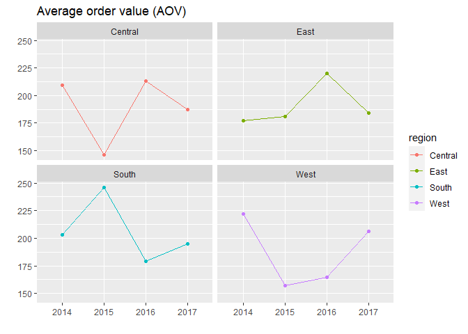

Case Study - Office Supplies
================
Ngoc Trang HA
2022-07-19

### Introduction

This case study project called “Office Supplies” is provided by
Datacamp. It is crucial to complete this case study in order to get the
Data Analyst certification. You can learn more information about the
certification in this
[link](https://support.datacamp.com/hc/en-us/categories/360000137934-Certification)

#### Scenario

At the moment, the company send office supplies out of warehouses in
four regions: East, West, South, Central, and all four warehouses stock
the same products. The Head of Sales thinks this leads to large amounts
of unsold products in some locations. The management would like you to
look at the data and present to them the popularity of products in each
region. Are there products that do not sell in some locations? Are there
any other patterns over time in each region that you can find in the
data?

#### Load the dataset and check the structure

``` r
office_supplies <- read.csv("office_supplies.csv")
str(office_supplies)
```

    ## 'data.frame':    9993 obs. of  12 variables:
    ##  $ Order.ID    : chr  "CA-2015-110870" "CA-2015-110870" "CA-2014-143210" "CA-2014-143210" ...
    ##  $ Order.Date  : chr  "2015-12-12" "2015-12-12" "2014-12-01" "2014-12-01" ...
    ##  $ Ship.Mode   : chr  "First Class" "First Class" "First Class" "First Class" ...
    ##  $ Region      : chr  "West" "West" "East" "East" ...
    ##  $ Product.ID  : chr  "TEC-AC-10002926" "OFF-SU-10001225" "TEC-PH-10004434" "FUR-FU-10003878" ...
    ##  $ Category    : chr  "Technology" "Office Supplies" "Technology" "Furniture" ...
    ##  $ Sub.Category: chr  "Accessories" "Supplies" "Phones" "Furnishings" ...
    ##  $ Product.Name: chr  "Logitech Wireless Marathon Mouse M705" "Staple remover" "Cisco IP Phone 7961G VoIP phone - Dark gray" "Linden 10\" Round Wall Clock, Black" ...
    ##  $ Sales       : num  299.94 25.76 271.9 45.84 9.82 ...
    ##  $ Quantity    : int  6 7 2 3 2 12 4 3 5 6 ...
    ##  $ Discount    : num  0 0 0 0 0 0 0 0 0 0.2 ...
    ##  $ Profit      : num  NA NA NA NA NA NA NA NA NA NA ...

``` r
view(office_supplies)
```

#### Cleaning data

First, we need to rename all columns that R can understand. Next, we
transform the data type of column “order_date” to datetime and then add
another column “year”. As there are trailling zeros in columns “sales”
and “profit”, we also need to remove them. Lastly, we remove any rows
that contain NA values in “profit” column.

``` r
office_supplies <- office_supplies %>% clean_names()
office_supplies <- office_supplies %>% filter(category == "Office Supplies")
office_supplies$order_date <- as.Date(office_supplies$order_date)     
office_supplies$year <- format(office_supplies$order_date,"%Y")
office_supplies$sales <- as.numeric(str_remove(office_supplies$sales,"0+$"))
office_supplies$profit <- as.numeric(str_remove(office_supplies$profit,"0+$"))
office_supplies2 <- office_supplies %>% drop_na(profit)
```

### Summary of Sales and Profit

``` r
summary(office_supplies$sales)
```

    ##     Min.  1st Qu.   Median     Mean  3rd Qu.     Max. 
    ##    0.444   11.760   27.390  119.312   79.920 9892.740

``` r
summary(office_supplies$profit)
```

    ##      Min.   1st Qu.    Median      Mean   3rd Qu.      Max.      NA's 
    ## -2929.484     2.244     7.056    20.084    19.650  4630.475      1208

### Top 5 products in each region

These tables shown below represent top 5 items measured by sales in each
region

#### In the Central

    ## # A tibble: 5 × 4
    ##   product_name                                 Units_Sold TotalSales TotalProfit
    ##   <chr>                                             <int>      <dbl>       <dbl>
    ## 1 Staples                                              70      237.         87.0
    ## 2 Staple envelope                                      34      352.        145. 
    ## 3 Easy-staple paper                                    29      360.        130. 
    ## 4 Avery Durable Binders                                26       54.1        16.0
    ## 5 Avery Heavy-Duty EZD View Binder with Locki…         26      115.         25.3

#### In the East

    ## # A tibble: 5 × 4
    ##   product_name            Units_Sold TotalSales TotalProfit
    ##   <chr>                        <int>      <dbl>       <dbl>
    ## 1 Staple envelope                 64       712.       330. 
    ## 2 Staples                         63       173.        63.3
    ## 3 Easy-staple paper               35       591.       280. 
    ## 4 Storex Dura Pro Binders         26       121.        37.8
    ## 5 Xerox 1906                      22       758.       345.

#### In the South

    ## # A tibble: 5 × 4
    ##   product_name                                 Units_Sold TotalSales TotalProfit
    ##   <chr>                                             <int>      <dbl>       <dbl>
    ## 1 Staples                                              27      123.         45.5
    ## 2 Staple envelope                                      23      175.         74.9
    ## 3 Tennsco Double-Tier Lockers                          23     4680.        178. 
    ## 4 Wilson Jones Turn Tabs Binder Tool for Ring…         22       72.3        15.0
    ## 5 GBC Prepunched Paper, 19-Hole, for Binding …         21      252.         82.0

#### In the West

    ## # A tibble: 5 × 4
    ##   product_name                                 Units_Sold TotalSales TotalProfit
    ##   <chr>                                             <int>      <dbl>       <dbl>
    ## 1 Staples                                              43       170.       72.3 
    ## 2 Wilson Jones Clip & Carry Folder Binder Too…         32       131.       34.6 
    ## 3 Easy-staple paper                                    29       473.      203.  
    ## 4 Eldon Shelf Savers Cubes and Bins                    29       202.        4.05
    ## 5 Staple envelope                                      28       274.      128.

### Items unsold in each region

#### In the Central

The number of unsold items in the Central is:

    ## [1] 294

#### In the East

The number of unsold items in the East is:

    ## [1] 238

#### In the South

The number of unsold items in the South is:

    ## [1] 422

#### In the West

The number of unsold items in the West is:

    ## [1] 192

There’s a total of 1058 products in the product list. The numbers shown
above point out that there are unsold products in all 4 regions, in
descending order: South, Central, East, West.

### Sales and profit performance over 3 years by region

``` r
office_supplies2 %>% 
  group_by(year,region) %>% 
  summarize(TotalProfit = sum(profit),TotalSales = sum(sales)) %>% 
  ggplot(aes(x=year,y=TotalSales,fill=region)) +
  geom_col() +
  geom_point(aes(y=TotalProfit,group=1)) +
  geom_line(aes(y=TotalProfit,group=1)) +
  facet_wrap(~region) +
  scale_y_continuous(breaks=c(0,15000,30000,45000,60000))+
  labs(title = "Annual sales and profit in each region")
```



### Units per transaction (UPT)

``` r
office_supplies %>% 
  group_by(year,region) %>% 
  summarise(unit_per_transaction = sum(quantity)/n_distinct(order_id)) %>%
  ggplot(aes(x=year,y=unit_per_transaction,color=region,group=1))+
  geom_line()+
  geom_point() +
  facet_wrap(~region) +
  labs(x="",y="Units sold per transaction",title="Units per transaction by region (UPT)")
```



### Average order value (AOV)

``` r
office_supplies %>% 
  group_by(year,region) %>% 
  summarise(transactions = n_distinct(order_id),totalsales = sum(sales),avg_transaction_value = totalsales/transactions) %>% 
  ggplot(aes(x=year,y=avg_transaction_value,color=region,group=1))+
  geom_point()+
  geom_line()+
  facet_wrap(~region)+
  labs(x="",y="",title="Average order value (AOV)")
```


